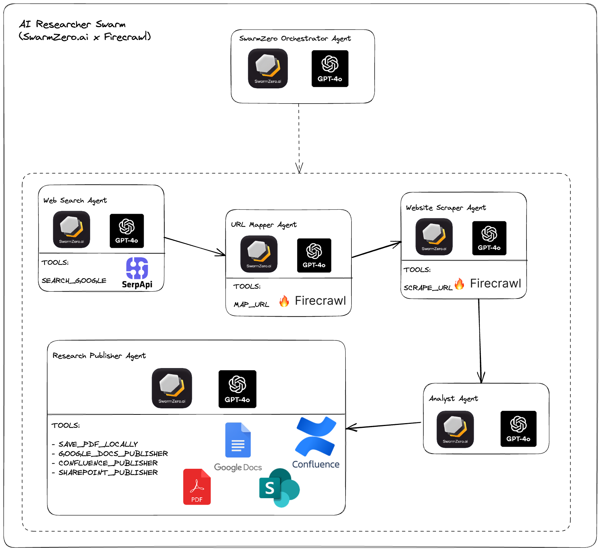
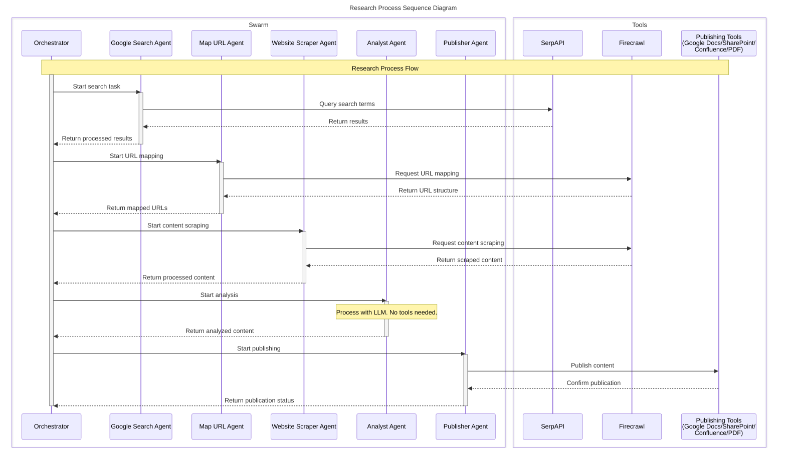
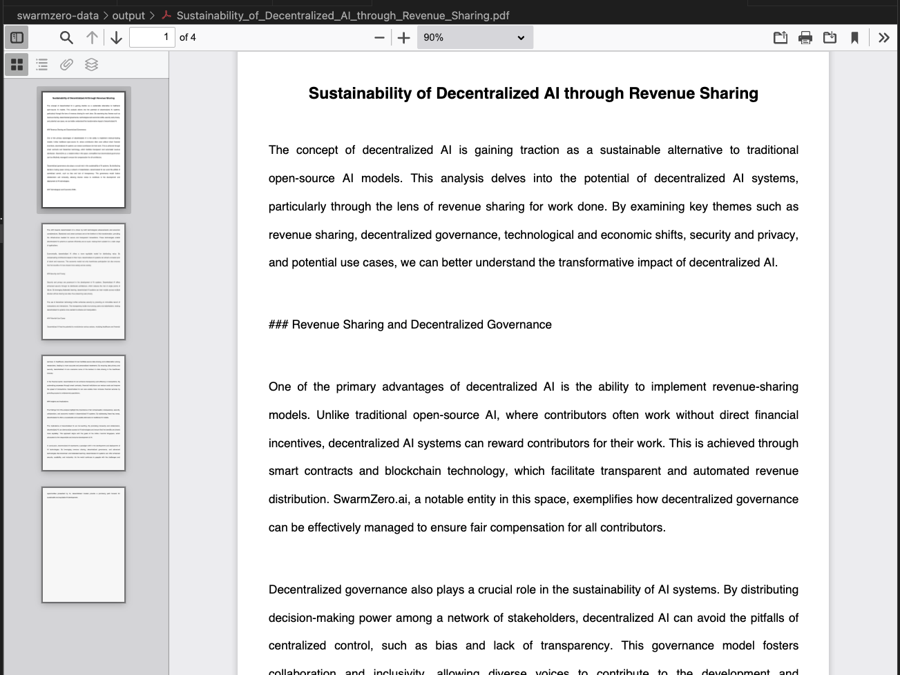
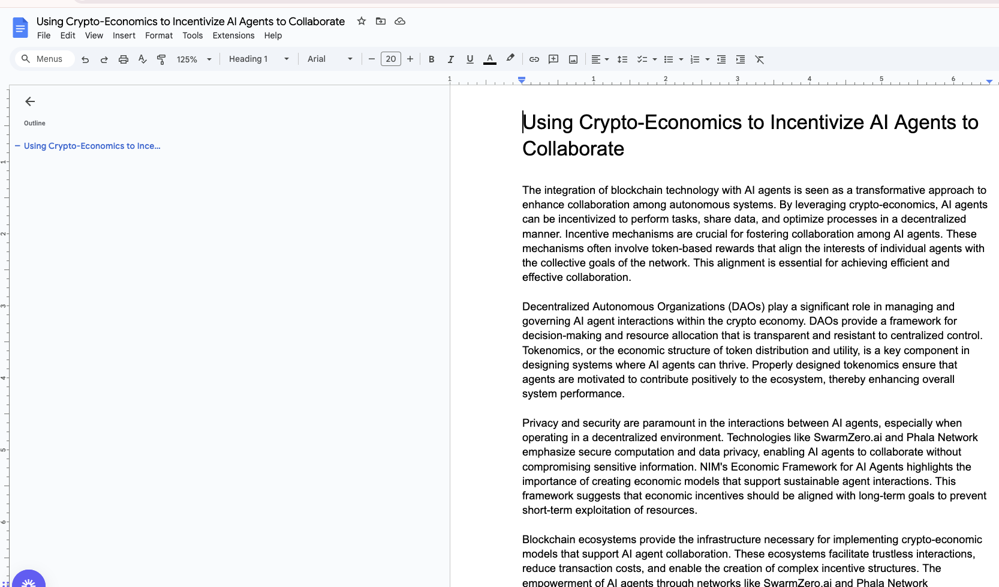
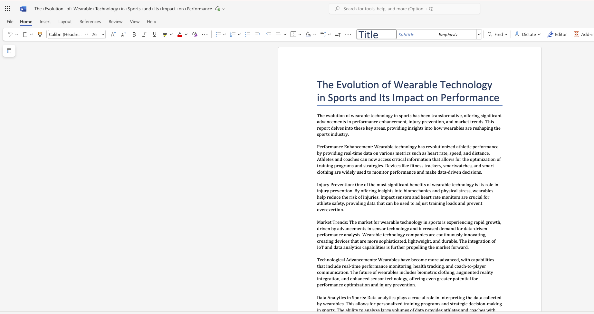
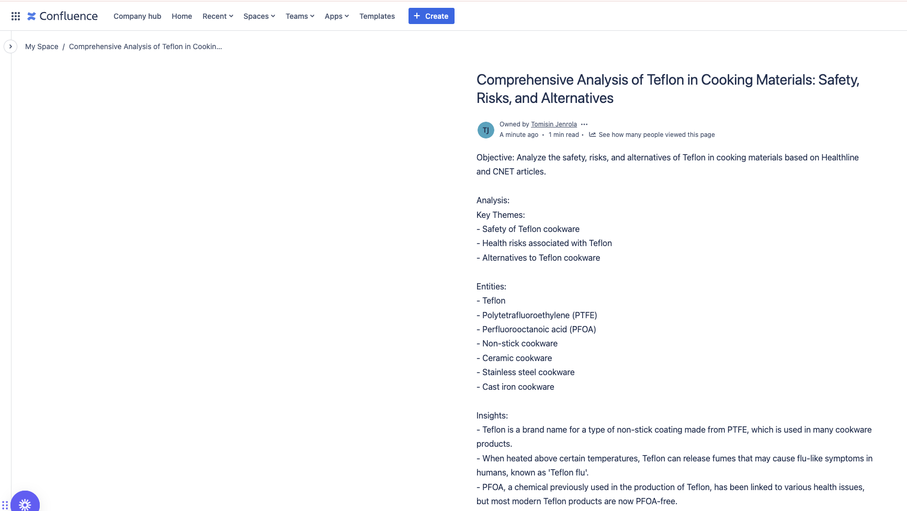

# Researcher Swarm
A swarm of AI agents that can perform & publish research based on a single prompt.

## Tech Used
- [SwarmZero.ai](https://swarmzero.ai)
  - [Agent Kit Python SDK](https://github.com/swarmzero/swarmzero)
- [Firecrawl](https://www.firecrawl.dev)
- [SerpApi](https://serpapi.com)

Find out more about SwarmZero's integrations at [swarmzero.ai/integrations](https://swarmzero.ai/integrations).

## Diagrams

### AI Researcher Swarm Overview Diagram


### AI Researcher Swarm Sequence Diagram


## Installation

1. **Clone the Repository:**
    ```bash
    git clone https://github.com/swarmzero/examples.git
    cd examples/swarms/researcher_swarm
    ```

2. **Create a Virtual Environment and Activate It:**
    ```bash
    python3 -m venv .venv
    source .venv/bin/activate
    ```

3. **Install Dependencies:**
    ```bash
    pip install -r requirements.txt
    ```

4. **Set Up Environment Variables:**
    - **Copy the Example Environment File:**
        ```bash
        cp .env.example .env
        ```
    - **Populate the `.env` File:**
        Open the `.env` file in your preferred text editor and fill in the required API keys and configuration settings as detailed below.

## Obtaining and Setting Up Environment Variables

To ensure the application functions correctly, you need to obtain and set several environment variables. Follow the step-by-step instructions for each required variable:

### 1. **API Keys**
This projects uses `gpt-4o` by default, but you can easily swap it out for any of our [supported models](https://docs.swarmzero.ai/sdk/agent-kit#supported-large-language-models-llms). Ensure to update the model name in the [swarmzero_config.toml](./swarmzero_config.toml) file.

#### a. **OpenAI API Key**
   - **Sign Up / Log In:** Visit the [OpenAI website](https://platform.openai.com/) and sign up or log in to your account.
   - **Generate API Key:** Navigate to the API section and generate a new API key.
   - **Set in `.env`:**
     ```
     OPENAI_API_KEY=your_openai_api_key
     ```

#### b. **Mistral API Key**
   - **Visit Mistral's Website:** Go to the [Mistral AI](https://www.mistral.ai/) website.
   - **Sign Up / Log In:** Create an account or log in if you already have one.
   - **Obtain API Key:** Follow the instructions to generate or retrieve your API key.
   - **Set in `.env`:**
     ```
     MISTRAL_API_KEY=your_mistral_api_key
     ```

#### c. **Anthropic API Key**
   - **Access Anthropic's Platform:** Navigate to [Anthropic's developer portal](https://www.anthropic.com/api).
   - **Create an Account:** Register or sign in to your existing account.
   - **Generate API Key:** Obtain your API key from the dashboard.
   - **Set in `.env`:**
     ```
     ANTHROPIC_API_KEY=your_anthropic_api_key
     ```

#### d. **Gemini API Key**
   - **Visit Google AI Studio:** Go to [Google AI Studio](https://aistudio.google.com/app/apikey).
   - **Sign Up / Log In:** Sign in with your Google account.
   - **Get API Key:** Click "Create API key" to generate a new key.
   - **Set in `.env`:**
     ```
     GEMINI_API_KEY=your_gemini_api_key
     ```

#### e. **Firecrawl API Key**
   - **Go to Firecrawl's Website:** Visit [Firecrawl](https://www.firecrawl.dev).
   - **Register / Log In:** Create an account or log in.
   - **Retrieve API Key:** Access your dashboard to find or generate your API key.
   - **Set in `.env`:**
     ```
     FIRECRAWL_API_KEY=your_firecrawl_api_key
     ```

#### f. **SerpApi Key**
   - **Visit SerpApi:** Head over to [SerpApi](https://serpapi.com/).
   - **Sign Up / Log In:** Create an account or log in.
   - **Obtain API Key:** Find your API key in the dashboard.
   - **Set in `.env`:**
     ```
     SERP_API_KEY=your_serpapi_key
     ```

### 2. **SharePoint Credentials**

#### a. **SharePoint Client ID and Secret**
   - **Access Azure Portal:** Go to the [Azure Portal](https://portal.azure.com/).
   - **Register an Application:**
     1. Navigate to **Azure Active Directory** > **App registrations**.
     2. Click **New registration** and provide the necessary details.
   - **Configure API Permissions:**
     1. In your app registration, go to **API permissions**
     2. Click **Add a permission**
     3. Select **Microsoft Graph**
     4. Choose **Application permissions** (not Delegated)
     5. Add the following permissions:
        - Files.ReadWrite.All
        - Sites.ReadWrite.All
     6. Click **Grant admin consent** for these permissions
   - **Create Client Secret:**
     1. Go to **Certificates & secrets**
     2. Click **New client secret**
     3. Add a description and choose an expiration
     4. Copy the secret value immediately (you won't be able to see it again)
   - **Set in `.env`:**
     ```
     SHAREPOINT_CLIENT_ID=your_sharepoint_client_id
     SHAREPOINT_CLIENT_SECRET=your_sharepoint_client_secret
     ```

#### b. **Tenant ID**
   - **Find Tenant ID in Azure:**
     1. In the Azure Portal, go to **Azure Active Directory** > **Overview**.
     2. Copy the **Tenant ID**.
   - **Set in `.env`:**
     ```
     SHAREPOINT_TENANT_ID=your_sharepoint_tenant_id
     ```

#### c. **Site ID and Drive ID**
   - **Access SharePoint Site:**
     1. Navigate to your SharePoint site.
     2. Use SharePoint APIs or the SharePoint admin center to retrieve the **Site ID** and **Drive ID**.
   - **Set in `.env`:**
     ```
     SHAREPOINT_SITE_ID=your_sharepoint_site_id
     SHAREPOINT_DRIVE_ID=your_sharepoint_drive_id
     ```

### 3. **Google API Credentials**

#### a. **Google Application Credentials**
   - **Create a Project in Google Cloud Console:**
     1. Visit the [Google Cloud Console](https://console.cloud.google.com/).
     2. Create a new project or select an existing one.
   - **Enable APIs:**
     - Enable the **Google Docs API** and **Google Drive API** for your project.
   - **Create OAuth Credentials:**
     1. Go to **APIs & Services** > **Credentials**.
     2. Click **Create Credentials** > **OAuth client ID**.
     3. Select **Desktop app** and provide a name.
     4. Click **Create** and download the `credentials.json` file.
   - **Set in `.env`:**
     ```
     GOOGLE_APPLICATION_CREDENTIALS=./credentials.json
     ```

#### b. **Google Scopes**
   - **Scopes Definition:** Define the scopes required for the application.
   - **Set in `.env`:**
     ```
     GOOGLE_SCOPES=https://www.googleapis.com/auth/documents https://www.googleapis.com/auth/drive.file
     ```

### 4. **Confluence Credentials**

#### a. **API Token**
   - **Log In to Confluence:** Access your [Atlassian account](https://id.atlassian.com/manage-profile/security/api-tokens).
   - **Generate API Token:**
     1. Go to **API tokens**.
     2. Click **Create API token**, provide a label, and generate.
     3. Copy the generated token.
   - **Set in `.env`:**
     ```
     CONFLUENCE_API_TOKEN=your_confluence_api_token
     ```

#### b. **Other Confluence Details**
   - **Set in `.env`:**
     ```
     CONFLUENCE_BASE_URL=https://yourdomain.atlassian.net/wiki
     CONFLUENCE_ORGANISATION_ID=your_confluence_organisation_id
     CONFLUENCE_USERNAME=your_confluence_username
     CONFLUENCE_SPACE_KEY=your_confluence_space_key
     ```

## Configuration

Ensure all necessary environment variables are set in the `.env` file, including:

- **API Keys:**
  - `OPENAI_API_KEY`
  - `MISTRAL_API_KEY` (optional)
  - `ANTHROPIC_API_KEY` (optional)
  - `GEMINI_API_KEY` (optional)
  - `FIRECRAWL_API_KEY`
  - `SERP_API_KEY`

- **SharePoint Credentials:**
  - `SHAREPOINT_CLIENT_ID`
  - `SHAREPOINT_CLIENT_SECRET`
  - `SHAREPOINT_TENANT_ID`
  - `SHAREPOINT_SITE_ID`
  - `SHAREPOINT_DRIVE_ID`

- **Google API Credentials:**
  - `GOOGLE_SCOPES`
  - `GOOGLE_APPLICATION_CREDENTIALS`

- **Confluence Credentials:**
  - `CONFLUENCE_BASE_URL`
  - `CONFLUENCE_ORGANISATION_ID`
  - `CONFLUENCE_USERNAME`
  - `CONFLUENCE_API_TOKEN`
  - `CONFLUENCE_SPACE_KEY`

## Usage

Run the main application using:

```bash
python main.py
```

This will initialize the AI agents, perform web searches, map URLs, scrape content, and publish the results to the configured platforms.

### Example Prompts

When prompted, you can enter research queries like:
- *Research the history of the internet*
- *Research crypto-economics and AI agent collaboration, publish to Google Docs*
- *Research the history of the stock market and Federal Reserve, publish to Confluence*
- *Research distributed model training for LLMs and publish to SharePoint*

Each prompt will trigger the swarm to:
1. Search for relevant information
2. Extract and analyze content
3. Generate a comprehensive research document
4. Publish to your specified platform (it defaults to saving a PDF locally if not specified)

## Features

- **AI-Driven Research:** Utilize multiple AI agents to conduct comprehensive research based on a single prompt.
- **Integration with Services:**
  - **Google Docs:** Automatically publish research findings to Google Docs.
  - **SharePoint:** Upload and manage documents within SharePoint.
  - **Confluence:** Publish documentation and research results to Confluence.
- **Search and Scrape:** 
  - **SerpAPI:** Perform automated Google searches
  - **Firecrawl:** Advanced web scraping and URL mapping
- **Configuration Management:** Easily manage configurations through environment variables.

## Example Outputs

### Local PDF

More generated PDFs can be found in the [sample outputs](./sample-outputs) folder.

### Google Docs


### SharePoint


### Confluence



## Contributing

Contributions are welcome! Please follow these steps:

1. Fork the repository.
2. Create a new branch for your feature or bugfix.
3. Commit your changes with clear messages.
4. Push to your fork and create a pull request.


## Inspiration

This project is inspired by the [Firecrawl Web Extractor by Eric Ciarla](https://github.com/mendableai/firecrawl/tree/main/examples/openai_swarm_firecrawl_web_extractor). It demonstrates the effective integration of AI agents with web scraping tools to automate data extraction and processing tasks, serving as a foundation for building sophisticated research swarms.


## Contact

For any questions or support, either create an issue on GitHub or reach out to us on [Discord](https://discord.gg/UyR6j3zBsX).
